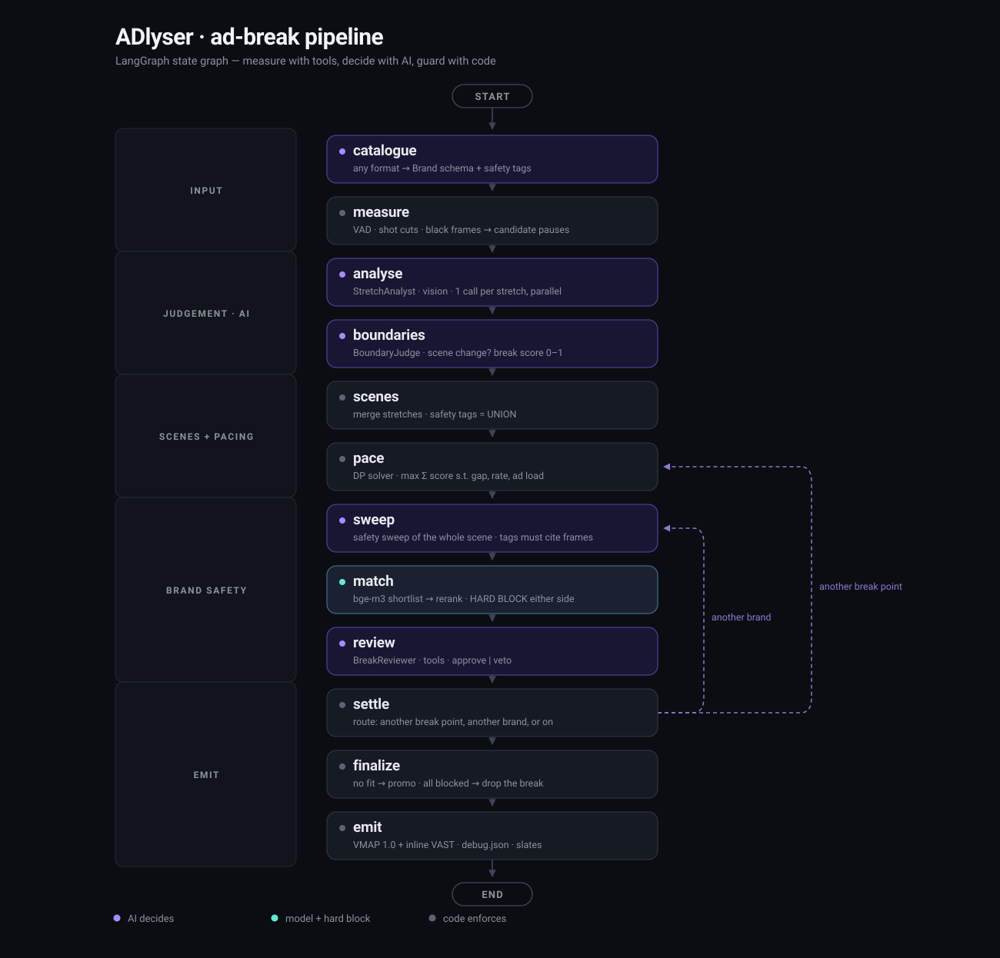

# ADlyser

**Live demo: https://13-126-111-29.sslip.io**

**Context-aware ad-break placement for long-form Bengali drama.**
Built for the hoichoi AI Builders Hackathon'26, Problem 1: *Context-Aware Video Segmentation & Intelligent Ad Placement*.

ADlyser watches an episode and answers three questions for every possible ad break:

| | Question |
|---|---|
| **Where** | Is this a natural, non-jarring place to cut? No mid-sentence cuts. |
| **Whether** | Is a break warranted here, given the pacing rules (max breaks per hour, minimum gap, ad-load cap)? |
| **What** | Which brand fits this moment? The scene's dominant activity decides, and a brand's negative contexts are a hard block. |

It outputs an IAB **VMAP 1.0** manifest (inline VAST 3.0), a **debug JSON** explaining every decision, and a **web player** that cuts to the ad and resumes.

## What is used, in plain words

| Job | What we use | Where it runs |
|---|---|---|
| Understand the video (what happens in each scene, which pauses are real scene changes, which brand fits, final review) | **DeepSeek** (`deepseek-flash`, vision and text), an open-weights model | DeepSeek's hosted API |
| Bengali transcript (optional, noisy hint only) | **Whisper `whisper-large-v3`**, an open-source model | Groq's hosted API |
| Match brands to scenes | **bge-m3** embeddings, open source | On our own server, on CPU |
| Find silences, cuts, black frames | Silero VAD, PySceneDetect, ffmpeg | On our own server |
| Deploy | **Terraform** script that builds one AWS EC2 server with HTTPS | AWS, ap-south-1 |

## Open source and self-hosting: what we tried

hoichoi prefers open-source models on its own infrastructure, so we planned to self-host the models on AWS GPU servers. We asked AWS for GPU quota, but we could not get a GPU instance in time, so we dropped that plan.

What we did instead:

- We use open models (DeepSeek, Whisper, bge-m3), but DeepSeek and Whisper are called through hosted APIs (DeepSeek and Groq). Only bge-m3 runs on our own server.
- Every model sits behind a setting in `config.yaml` (`base_url` and `model`). Moving DeepSeek to a self-hosted server that speaks the OpenAI API (for example vLLM) is a config change, with no code change.
- The transcript also has a `local` mode (faster-whisper on the server's CPU). It works, but its Bengali is much weaker than `whisper-large-v3`, so the demo uses Groq.
- Nothing in the code needs a GPU.

## Architecture

<p align="center">
  
</p>

The diagram is generated from the compiled graph by `uv run python -m scripts.graph_image`, so it cannot
drift from the code: the script fails if a node is added or renamed. Violet nodes are where a model
decides, grey are where code enforces, and the dashed edges are the reviewer's veto loops — a veto sends
the break back for another brand, or sends the pacing solver to the next-best break point.

## Approach: measure with tools, decide with AI, guard with code

1. **Measure, pause-first** (deterministic): start from the audio. Find silences (Silero VAD), keep only those that contain a camera cut or fade to black (PySceneDetect, ffmpeg), and optionally transcribe the dialogue (Groq `whisper-large-v3`). Mid-sentence cuts are impossible by construction.
   The transcript is noisy context only: it can add evidence for a safety tag but never clears one, candidates come from the audio alone, and the pipeline works the same without it.
2. **Decide** (AI agents in a LangGraph pipeline):
   - **StretchAnalyst** (vision): looks at frames and dialogue across each stretch between candidate pauses, and tags its activity, mood and safety topics.
   - **BoundaryJudge** (vision): decides whether each pause is a real scene change and how natural a break it is. Confirmed changes form the scene segmentation.
   - **CatalogueNormaliser**: turns any brand catalogue (JSON, CSV or free text) into one schema.
   - **BrandMatcher**: shortlists brands by embeddings, then an LLM re-ranks them.
   - **BreakReviewer**: checks dense frames on both sides of a break and can veto it.
3. **Guard** (code, never an LLM):
   - Cuts only in real silence, snapped to a shot cut.
   - Pacing is solved as a constraint problem.
   - Negative contexts are a hard block: a brand is ruled out if its blocked topics appear in the scene before **or** the scene after the break.
   - When in doubt, ADlyser drops the brand or the break, never the rule.

Every decision is recorded with its evidence and shown in the player's **Decision Trace**. A new brand can be added and re-matched with no code changes.

## Tech stack

| Layer | Choice |
|---|---|
| Backend | Python 3.12, uv, FastAPI, Pydantic v2, LangGraph, `openai` client |
| Perception | PySceneDetect, Silero VAD, ffmpeg, Groq whisper-large-v3 transcript (optional) |
| AI | DeepSeek `deepseek-flash` (vision + text) behind a swappable `base_url` + model setting, bge-m3 embeddings on CPU |
| Frontend | React, Vite, TypeScript, Video.js |
| Output | VMAP 1.0 + VAST 3.0, debug JSON |
| Deploy | Terraform, AWS EC2, Caddy (HTTPS on sslip.io), systemd |

## Run it locally

You need Python 3.12, [uv](https://docs.astral.sh/uv/), Node 22 and ffmpeg.

```bash
uv sync
cp .env.example .env    # then fill in the keys below
```

`.env` keys:

- `DEEPSEEK_API_KEY` is required. All the vision and text calls use it.
- `GROQ_API_KEY` is needed for the transcript, which is on by default (`transcribe.enabled: true` in `config.yaml`). To run without it, set `ADLYSER_TRANSCRIBE__ENABLED=false`.

Point ADlyser at your videos. `videos_dir` in `config.yaml` is set to the author's folder, so override it:

```bash
export ADLYSER_VIDEOS_DIR=/path/to/your/videos
```

Any setting in `config.yaml` can be overridden this way with `ADLYSER_<SECTION>__<KEY>`.

**Analyse one video from the command line.** This writes `vmap.xml` and `debug.json` into the output folder:

```bash
uv run --env-file .env python -m adlyser run /path/to/video.mp4 --out data/my_video
```

**Run the web app.** Start the API, then the web app in a second terminal, and open http://localhost:5173:

```bash
uv run --env-file .env uvicorn adlyser.api:app --port 8000
cd web && npm ci && npm run dev
```

From the web app you can play a sample, upload a video, watch the agent graph progress, read the Decision Trace, and add a new brand and re-match it.

The first start downloads the bge-m3 model from Hugging Face (about 2 GB). Every LLM answer is cached on disk in `data/cache`, so re-running a video with the same settings is free.

**Checks:**

```bash
uv run pytest
uv run ruff check . && uv run ruff format --check .
cd web && npm run build
```

The tests never call a paid API.

## Deploy (Terraform)

The live demo runs on one AWS EC2 `c6i.2xlarge` (8 CPUs, no GPU) in `ap-south-1`. Terraform (in `deploy/terraform/`) creates the instance, an Elastic IP, a security group (ports 80 and 443 open, SSH only from your IP), and a first-boot script that installs Caddy, Node, uv and the code. Caddy gives automatic HTTPS on an `<ip>.sslip.io` name. The API runs as a systemd service.

You need the AWS CLI logged in, and Terraform installed.

**1. Create the server:**

```bash
ssh-keygen -t ed25519 -f ~/.ssh/adlyser -N ""      # once, if you do not have the key
cd deploy/terraform
terraform init
terraform apply -var "ssh_cidr=$(curl -4 -s https://ifconfig.me)/32"
# if c6i.2xlarge is not allowed on your account, add: -var instance_type=m7i-flex.large
```

Use `curl -4`: the security group needs an IPv4 address. The apply prints the server IP and the demo URL.

**2. Wait for first-boot setup** (about 3 minutes). This prints `ready` when it is done:

```bash
IP=$(terraform output -raw public_ip)
ssh -i ~/.ssh/adlyser ubuntu@$IP 'test -f /var/log/adlyser-bootstrap.done && echo ready'
```

**3. Copy the videos, the analysed data and the keys** (run from the repo root):

```bash
rsync -avz -e "ssh -i ~/.ssh/adlyser" /path/to/your/videos/ ubuntu@$IP:/srv/videos/
rsync -avz -e "ssh -i ~/.ssh/adlyser" --exclude uploads --exclude 'cache.*' --exclude '*.log' data/ ubuntu@$IP:ADlyser/data/
scp -i ~/.ssh/adlyser .env ubuntu@$IP:ADlyser/.env
```

**4. Install and start the service:**

```bash
ssh -i ~/.ssh/adlyser ubuntu@$IP
  chmod 600 ~/ADlyser/.env
  cd ~/ADlyser && ~/.local/bin/uv sync
  ~/.local/bin/uv run hf download BAAI/bge-m3
  cd web && npm ci && npm run build
  sudo systemctl enable --now adlyser
```

Open the URL from `terraform output -raw url`. After you copy new analysed data later, run `sudo systemctl restart adlyser` on the server so the API sees it.

**5. Tear everything down** when you are finished, so it stops costing money:

```bash
cd deploy/terraform && terraform destroy -var "ssh_cidr=$(curl -4 -s https://ifconfig.me)/32"
```

More detail: [deploy/terraform/README.md](deploy/terraform/README.md).

## Brands

All brands in `catalogue/` are **fictional**, created for this hackathon. The current 12:

- **Lotus Lassi** (Beverage)
- **Grain & Grove** (Food)
- **Nexora Insurance** (Insurance)
- **Roamora** (Travel)
- **PulseGrid** (Telecom)
- **Morrow Thread** (Fashion)
- **Hearthline** (Home)
- **BrightStep** (Education)
- **Sundrop Pantry** (Grocery)
- **Velora Care** (Personal Care)
- **CrispCart** (Quick Commerce)
- **Leafline Tea** (Beverage)

A brand's negative contexts are mapped to safety tags and unioned with a default floor (death and grief, funeral rituals, sexual content), so no brand is a wildcard. Each brand gets a 10-second title-card ad made with ffmpeg, so no real ad files are needed.

## Known limitations and next steps

- Speech-based pauses can land in music bridges; an audio-energy gate would catch them.
- Dropped breaks are not back-filled; pacing should re-run after a drop.
- Reviewer vetoes need frames from both sides of the cut.
- Mood and tone are not yet used for brand fit.
- The models are open, but DeepSeek and Whisper run on hosted APIs. Self-hosting them on a GPU server is the next step, and it is a config change.

## License

MIT
